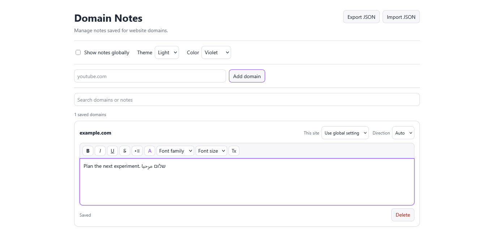

# Domain Notes for Firefox

Persistent notes for website domains. Local storage, rich text, English/Hebrew/Arabic support, and optional website access. No accounts, telemetry, cloud sync, or background network requests.

[](https://github.com/anti-charm/domain-notes-firefox/actions/workflows/checks.yml)

[Privacy](PRIVACY.md) · [Security](SECURITY.md) · [Release verification](docs/release-verification.md)



## Start here

**Firefox desktop 142 or newer.** Mozilla Add-ons publication is being prepared; there is no signed public installation linked here yet.

For development, extract the clean source ZIP, open `about:debugging#/runtime/this-firefox`, choose **Load Temporary Add-on**, and select `manifest.json`. Temporary add-ons disappear at browser restart. Use the Mozilla-signed release for everyday use once published.

1. Visit a normal website and open **Domain Notes** from Firefox's extension controls.
2. Choose **Enable on this site** to grant access to its domain and subdomains. Firefox asks before granting access.
3. To use notes across ordinary HTTP/HTTPS websites, choose **Enable on all sites**. This broader access is optional.
4. Open the floating note button, select **Edit**, type your note, and select **Done**. Changes save automatically.
5. Open **Note manager** to find, edit, add, delete, or back up notes without needing a page launcher.

A note belongs to the registrable domain, rather than one page URL. Subdomains usually share a note; independently hosted domains such as different `github.io` sites stay separate, using bundled Public Suffix List rules.

## Make it yours

- Bold, italic, underline, strikethrough, bullets, text color, font, and size controls.
- Auto, left-to-right, and right-to-left writing direction; English, Hebrew, and Arabic interface translations.
- Light/Dark appearance and six accent colors.
- Drag the launcher or panel; resize from its edges and corners. **Reset position & size** preserves content and appearance.
- **Use global setting**, **Always show**, and **Always hide** control visibility. Firefox permission controls access separately.
- Global display off still allows explicitly shown, permitted domains. Always hide takes precedence over global display.
- Same-domain browser tabs synchronize saved notes. Empty notes disappear from the manager.

If the same note changes in another window while you are editing it, saving stops with a conflict message. Copy your unsaved text before reloading; this prevents overwriting the other edit.

## Permissions explained

| Permission | Purpose |
| --- | --- |
| `storage` | Save notes and preferences locally in Firefox. |
| `scripting` | Place the launcher on permitted websites. |
| `activeTab` | Identify the active website when you open the extension. |
| Optional HTTP/HTTPS hosts | Enable the chosen domain, or all ordinary sites after an explicit action. |

No website permission is granted automatically at installation. A site grant covers HTTP and HTTPS plus that domain's subdomains. Firefox may describe global access as access to data on all websites. The add-on uses it to place its UI and contains no browsing-history collection or telemetry. Permission can be revoked in Firefox's add-on settings; saved notes remain available in the manager.

Private Browsing is disabled because Domain Notes saves persistent notes. Firefox blocks the launcher on privileged pages, its PDF viewer, and restricted Mozilla pages. Android compatibility has not been tested.

## Privacy and backups

Notes and preferences live in `browser.storage.local`. The add-on has no application server, external API, advertising, analytics, or cloud account. Opening an HTTP/HTTPS link in a note is ordinary browser navigation to that site. See [PRIVACY.md](PRIVACY.md).

**Notes and exported backups are not encrypted by Domain Notes.** Device access, browser-profile access, and independent device/cloud backups can expose them. JSON backups contain notes, formatting, layouts, visibility, direction, theme, and accent. They exclude the internal authentication token and Firefox permission grants. Import replaces the saved user-data stores after confirmation; keep a backup first. Website access may need to be granted again after moving to another installation.

Share a clean source download. Keep personal backups, profiles, screenshots of real notes, account details, and credentials out of issues, pull requests, and release uploads. Ignore rules help with Git but do not protect manual uploads or files already committed.

## Security

The editor runs in an extension-origin iframe. Ordinary website scripts cannot directly read its document, and editor key events do not bubble to the page. The page host handles lifecycle and geometry, while the editor authenticates initialization using an internal random token. Note content is never sent to the parent page.

Notes use sanitized structured JSON; HTML paste becomes plain text. Imported backups are validated, unsafe object keys are rejected, and only HTTP/HTTPS note links are made clickable with `noopener noreferrer`. The extension contains no dynamic code execution, remote scripts, or runtime dependencies.

A hostile page controls its outer DOM and can hide, cover, move, or replace the on-page UI. Use the extension's note manager on untrusted sites. Tests and scanners reduce risk; they cannot guarantee that every vulnerability has been found. Report vulnerabilities [privately](https://github.com/anti-charm/domain-notes-firefox/security/advisories/new), as described in [SECURITY.md](SECURITY.md).

## Development and release checks

Node.js 22+ runs checks without package installation:

```console
node --test tests/*.test.js
node scripts/security-audit.mjs
```

With npm available, use `npm run check`. Python 3.10+ builds reviewed source/runtime packages using only its standard library:

```console
python scripts/package.py
npx --yes web-ext@10.7.0 lint --source-dir dist/amo --warnings-as-errors --boring
```

Packaging uses a reviewed file inventory and fixed ZIP metadata. Tests cover domain grouping, permission actions, grants/revocation, formatting, imports, geometry, and the isolation contract. CI runs on Windows and Linux. See [CONTRIBUTING.md](CONTRIBUTING.md) and the [publishing guide](docs/publishing.md) for the Firefox acceptance checks and Mozilla submission process.

## License

Project code is MIT licensed. Bundled Public Suffix List data retains its MPL-2.0 license; see [THIRD_PARTY_NOTICES.txt](THIRD_PARTY_NOTICES.txt).
